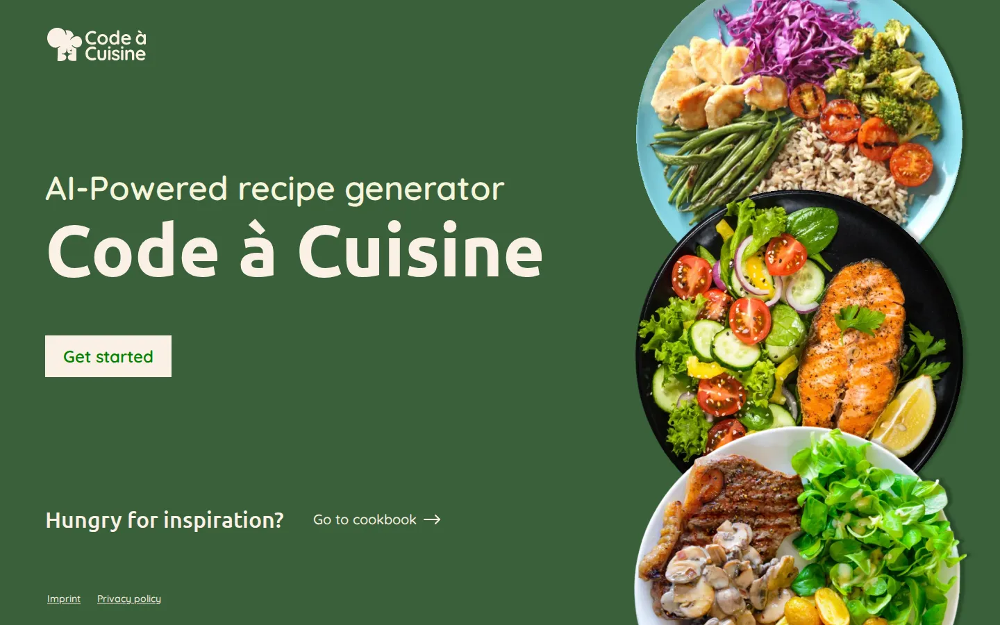
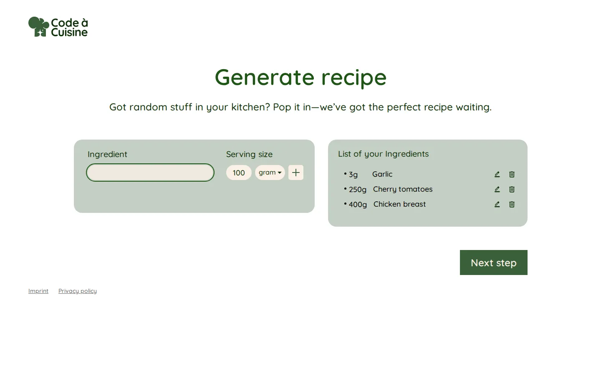
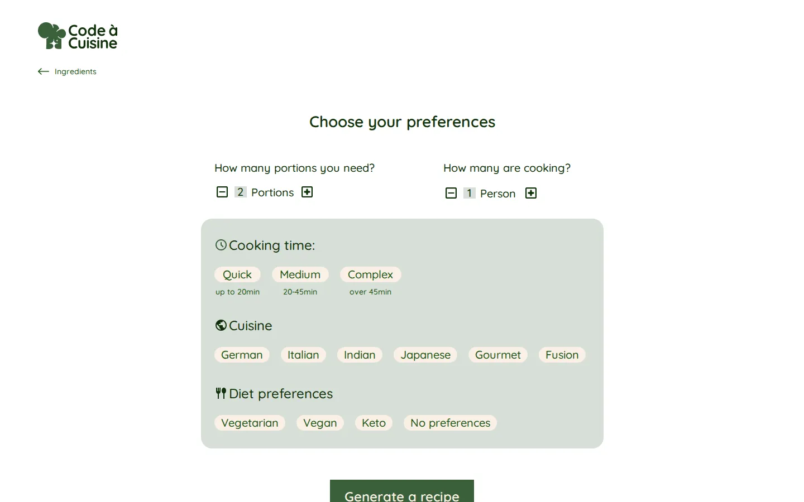
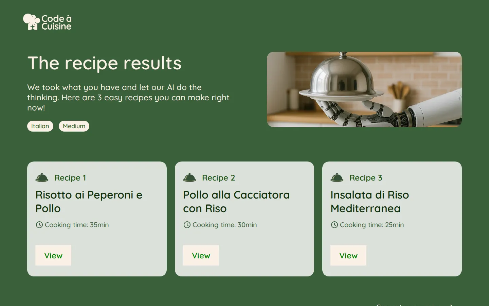
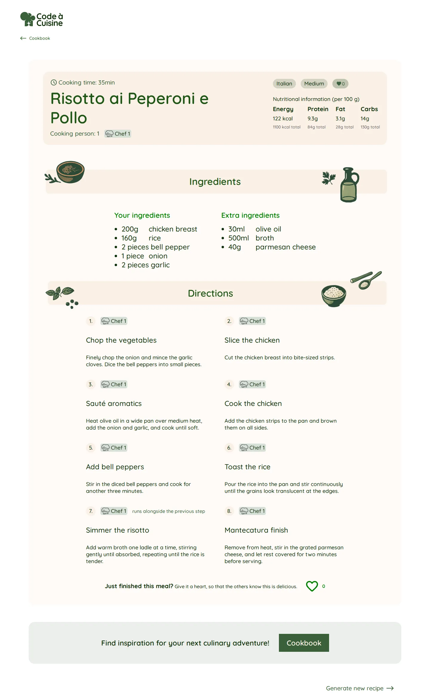
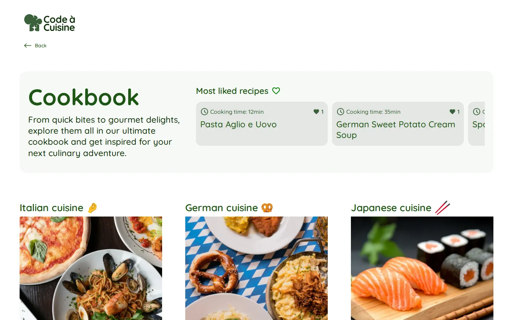
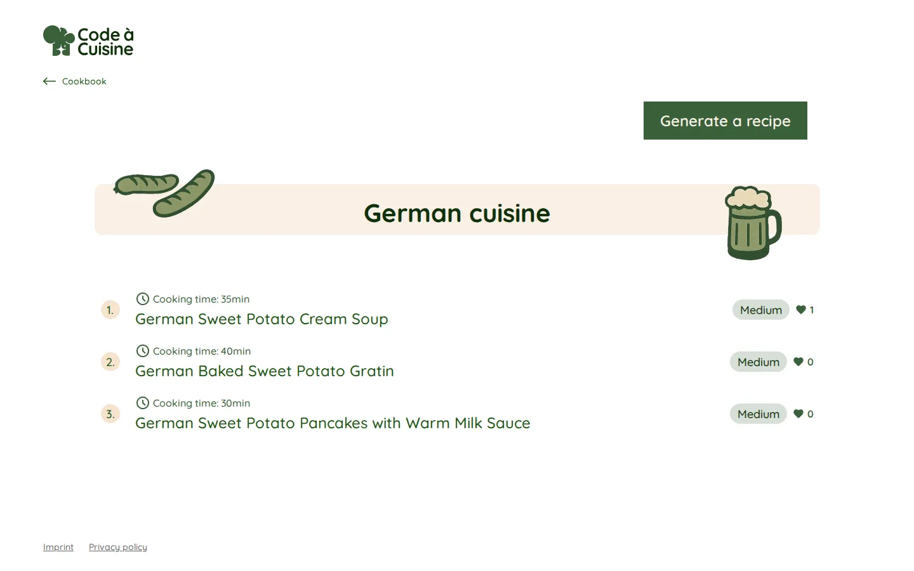
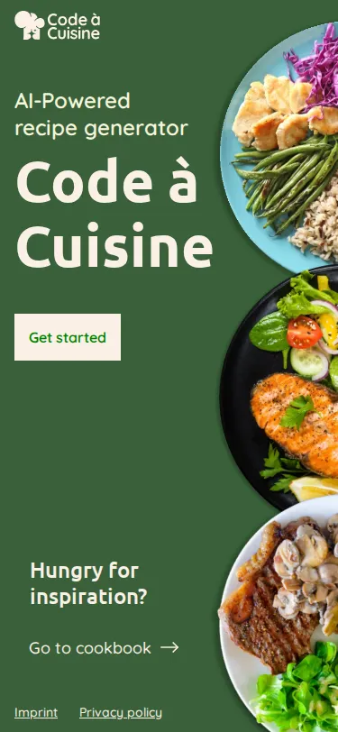
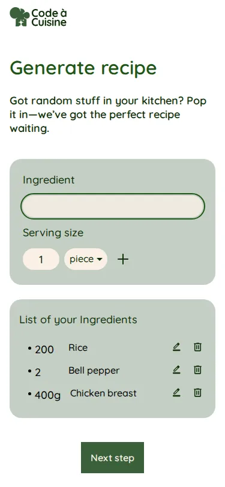
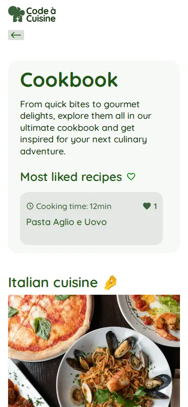

# Code à Cuisine

A web app that turns the ingredients you already have into AI-generated
recipes. Tell it what's in your kitchen and how many portions, cooks and
minutes you have, and it hands back three complete recipes with
step-by-step instructions and estimated nutrition. Every generated recipe
is stored in Firebase and stays browsable afterwards in a public library.
Built as the submission project for the "Code à Cuisine" coding bootcamp.

**Live demo:** [code-a-cuisine.yannicjundt.de](https://code-a-cuisine.yannicjundt.de)

## Screenshots

| Home                                        | Ingredients                                                             |
| ------------------------------------------- | ----------------------------------------------------------------------- |
|  |  |

| Preferences                                                                      | Results                                                           |
| -------------------------------------------------------------------------------- | ----------------------------------------------------------------- |
|  |  |

| Recipe detail                                                                     | Library                                                                    |
| --------------------------------------------------------------------------------- | -------------------------------------------------------------------------- |
|  |  |

| Cuisine page                                                    |
| --------------------------------------------------------------- |
|  |

Mobile (375×812):

| Home                                              | Ingredients                                                   | Library                                            |
| ------------------------------------------------- | ------------------------------------------------------------- | -------------------------------------------------- |
|  |  |  |

The loading screen only appears during a real generation call and isn't
pictured here — triggering it for a screenshot would have spent a slot of
the daily quota for no reason.

## Features

- **Ingredient list** with name, amount and unit (gram / ml / piece), plus
  autocomplete suggestions while typing.
- **Preferences**: portions (1–12), number of cooks (1–3), cooking time
  (quick / medium / complex), cuisine (German, Italian, Indian, Japanese,
  Gourmet, Fusion) and diet (vegetarian, vegan, keto, no preference).
- **Three recipe suggestions** per generation, each with chronological
  instructions, steps marked as running in parallel, and — when more than
  one person is cooking — steps assigned to individual cooks, each with a
  fixed area of the dish they own from start to finish (e.g. "Chef 1: pasta
  · Chef 2: sauce").
- **Estimated nutrition** (calories, protein, carbs, fat) per portion, the
  whole recipe's total, and each macronutrient's share of the total
  protein+carbs+fat weight, clearly labelled as an estimate.
- **Public library** of every generated recipe, grouped by cuisine, with a
  "most liked" strip and a like button per recipe (one like per browser,
  remembered locally).
- **Daily quota**: 3 generations per visitor (by IP) per day, capped at 12
  generations system-wide, both enforced server-side before the paid model
  call runs. The IP itself is never stored — only an HMAC-SHA256 hash of it
  keyed under the day, deleted every night for days that have passed.
- **Imprint and privacy policy**, reachable from every page's own footer.

## Architecture

```
Angular app → n8n webhook (Gemini) → Firebase Realtime Database
```

The Angular app never talks to the AI model or writes recipes directly. It
posts the recipe request to an n8n webhook, which checks the quota, calls
Gemini, verifies and normalizes the reply, stores the three recipes in
Firebase and answers with their ids. The app then reads recipes back from
Firebase directly (library, results, detail) and is only allowed to write
one thing itself: incrementing a recipe's like counter, enforced by the
Firebase database rules. See [`n8n/README.md`](n8n/README.md) for the
workflow details — quota handling, response verification and error
reporting.

## Stack

- Angular 22, standalone components, zoneless change detection, no SSR
- TypeScript ~6.0.2, SCSS (7-1 structure)
- Firebase Realtime Database for storing generated recipes
- n8n workflows for the AI recipe generation, called via webhook

## Setup

```bash
npm install
npm start
```

Runs on `http://localhost:4200`.

## Scripts

- `npm start` — dev server (`ng serve`)
- `npm run build` — production build (`ng build`)
- `npm run watch` — build in watch mode, development configuration
- `npx prettier --write .` — formats the project (config in `.prettierrc`,
  no npm script for it)

No test scripts — this project deliberately ships without a test setup.

## Project structure

```
src/app/pages/          home, generator, preferences, loading, results,
                         recipe-detail, library, cuisine, imprint, privacy
src/app/components/     counter, footer, header, ingredient-input,
                         ingredient-list, like-button, not-enough-popup,
                         pagination, tag, unit-select
src/app/core/           RecipeRequestService, RecipeApi, route guards,
                         Recipe/CuisineMeta models, ingredient suggestions
src/app/app.routes.ts   routing, incl. the generator-step guards
src/styles/             7-1 structure, design tokens as CSS custom
                         properties in src/styles/abstracts/_variables.scss
src/environments/       Firebase + n8n URLs (see below)
n8n/                    exported n8n workflow JSONs: recipe generation,
                         quota lookup, nightly quota cleanup, error handler
```

`src/app/pages/cuisine` implements the `/library/:cuisine` route — named
after what it shows, not the URL segment.

## `environment.ts`

`src/environments/environment.ts` is committed and contains no secrets: it
only holds the Firebase Realtime Database URL and the n8n webhook URLs.
Firebase's database rules deny every client write except incrementing a
recipe's `likes` field, and the n8n webhooks are rate-limited at the proxy
— so neither URL grants anything an attacker couldn't already see by
opening the deployed app.
